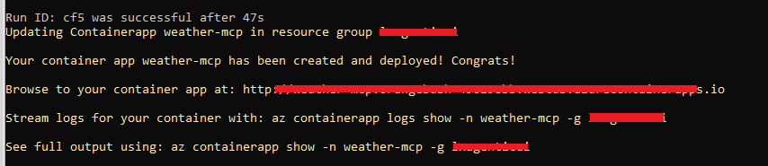
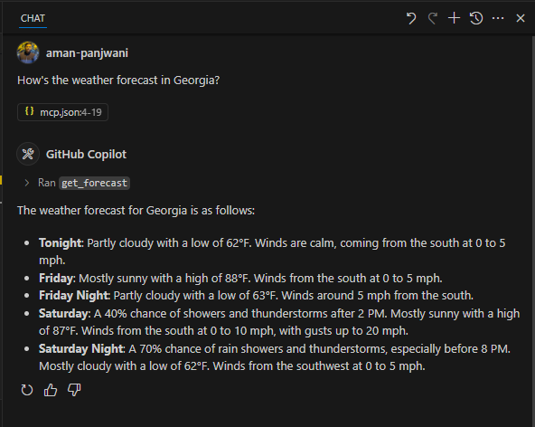

## Deploying & Connecting Your Remote MCP Weather Server

This project lets you deploy a cloud-based **Model Context Protocol (MCP)** server that delivers real-time weather data using the U.S. National Weather Service API. It’s built with FastAPI, supports Server-Sent Events (SSE) for real-time communication, and uses secure API key authentication.

This repository provides a ready-to-deploy **Weather MCP** server. You'll walk through the full setup from cloning the code, configuring authentication, deploying to Azure Container Apps, and finally connecting it inside **Visual Studio Code** using the MCP extension.

---

### Clone the Repository

```bash
git clone https://github.com/your-username/mcp-weather-server.git
cd mcp-weather-server
```

---

### Understand the Structure

Before deploying, familiarize yourself with the core components:

- **`weather.py`** – Defines two tools: `get_alerts()` and `get_forecast()` using the U.S. National Weather Service API.
- **`main.py`** – Wraps the tools in a FastAPI app exposed at `/sse`, with support for SSE.
- **`api_key_auth.py`** – Implements `x-api-key` header-based security for incoming requests.
- **`Dockerfile`** – Builds and packages the app using Python 3.13 and the `uv` web server.

---

### Configure API Key Authentication

Set your API key(s) securely via an environment variable:

```bash
export API_KEYS=<YOUR_API_KEY>
```

> You can also supply multiple comma-separated keys. No need to hardcode secrets into the source code.

---

### Build & Deploy to Azure Container Apps

Use the Azure CLI to build and deploy in a single step:

```bash
az containerapp up \
  -g <RESOURCE_GROUP> \
  -n weather-mcp \
  --environment <CONTAINERAPPS_ENV_NAME> \
  -l westus \
  --env-vars API_KEYS=<YOUR_API_KEY> \
  --source .
```

This command will:

- Build the image using the included Dockerfile.
- Deploy it to Azure Container Apps.
- Inject your API key(s) via `--env-vars`.

Once deployed, Azure CLI will return a public URL  this is the endpoint your MCP clients will use.



---

### Connect from Visual Studio Code

With the server up, connect it inside VS Code:

1. Create a `.vscode/mcp.json` file in your project:

```json
{
  "inputs": [
    {
      "type": "promptString",
      "id": "weather-api-key",
      "description": "Weather API Key",
      "password": true
    }
  ],
  "servers": {
    "weather-sse": {
      "type": "sse",
      "url": "https://weather-mcp.orangebush.westus.azurecontainerapps.io/sse",
      "headers": {
        "x-api-key": "${input:weather-api-key}"
      }
    }
  }
}
```

2. Open the MCP extension sidebar in VS Code.  
3. Click **Start** next to your server entry.  
4. Enter the API key when prompted.

You're now connected and ready to process real-time weather queries.

---

### Try It with GitHub Copilot Chat (Agent Mode)

1. Launch GitHub Copilot Chat in **Agent mode**.
2. Ask something like:

> _"How's the weather forecast in Georgia?"_

The agent will call your `get_forecast` tool behind the scenes and return a live forecast based on NWS data.



---

##  You're All Set!

Your MCP server is now:

- Cloud-hosted  
- API-key protected  
- Integrated with VS Code and GitHub Copilot  

You can now build custom agents that interact with real-time weather data from anywhere.
